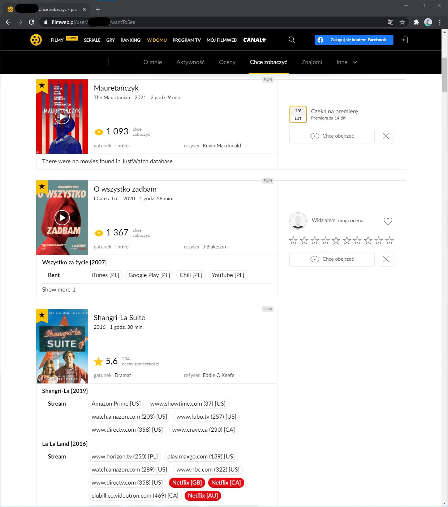
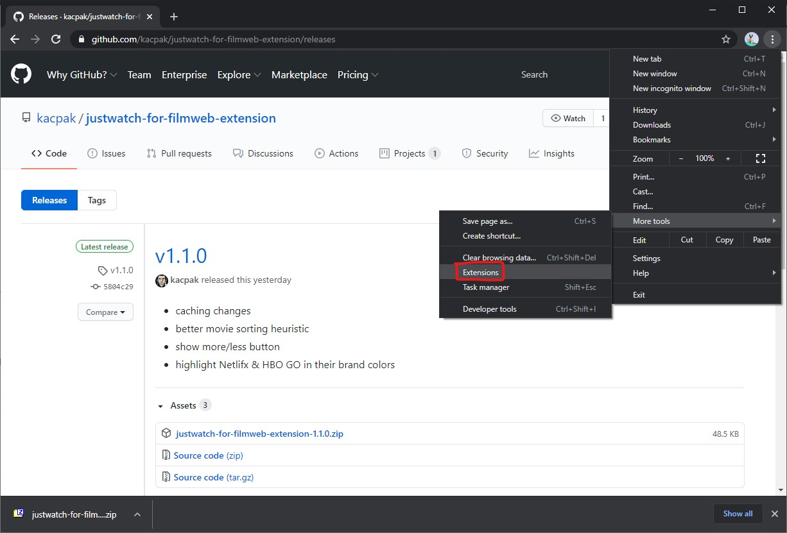
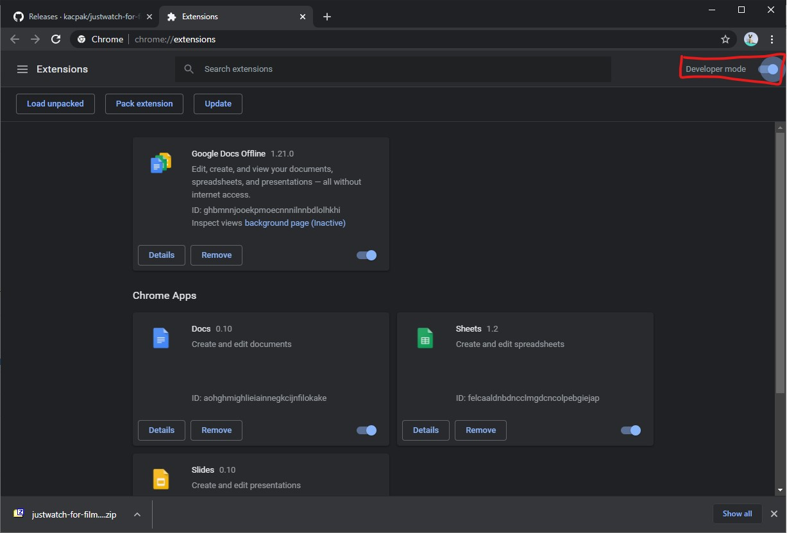
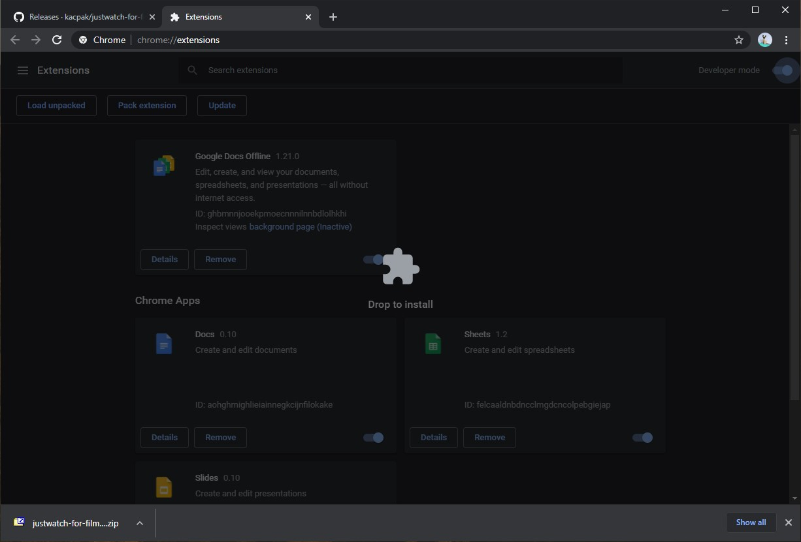
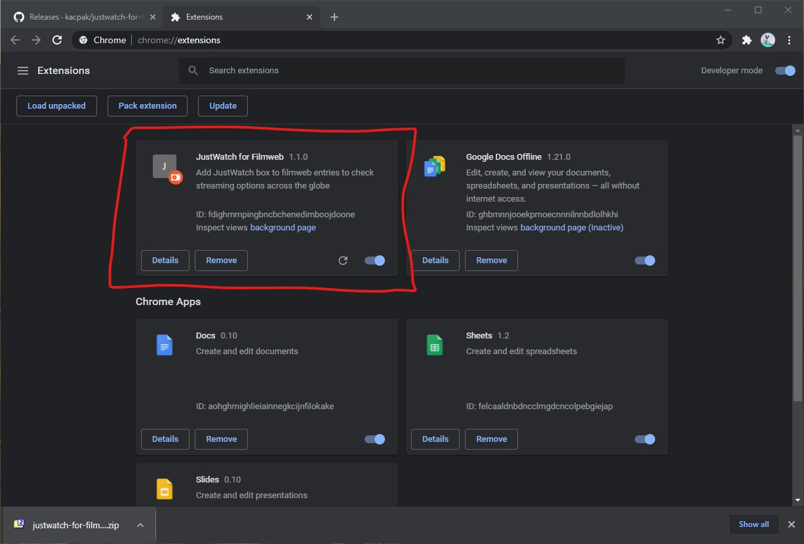

# JustWatch for Filmweb

Add JustWatch box to filmweb "wantToSee" page entries to check streaming options
across the globe

## Preview

## Installation instructions

- Download latest extension version from
  [Releases](https://github.com/kacpak/justwatch-for-filmweb-extension/releases)
  section (justwatch-for-filmweb-extension-X.X.X.zip)
- Open "Extensions" page in Chrome
  
- Enable "Developer mode" in top right corner
  
- Drag the downloaded .zip file directly onto the "Extensions" page
  
- Done! You should now see that the extensions was installed
  
